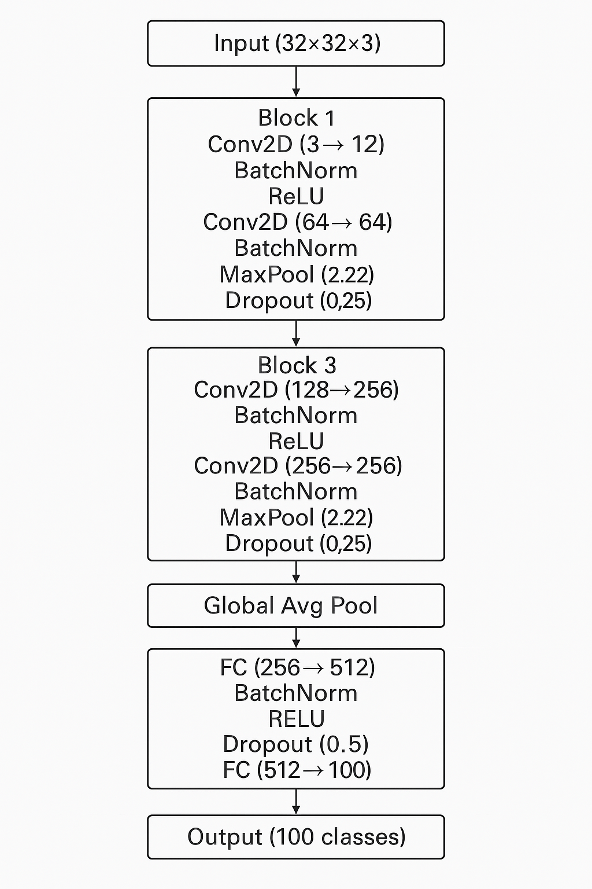

# Custom CNN Architecture for CIFAR-100 Classification

## Architecture Overview

My custom CNN architecture for CIFAR-100 image classification features 6 convolutional layers organized into 3 blocks, followed by global average pooling and fully connected layers for classification. The design follows modern CNN best practices while maintaining reasonable computational requirements.

## Network Structure Diagram

## Design Rationale

1. **Convolutional Blocks**: Each block follows a pattern of convolution → batch normalization → activation → convolution → batch normalization → activation → pooling → dropout. This structure allows the network to learn increasingly complex features while maintaining gradient flow.

2. **Channel Progression**: The number of channels increases progressively (3→64→128→256) to allow the network to learn more complex feature representations as the spatial dimensions decrease.

3. **Global Average Pooling**: Used instead of flattening to reduce the number of parameters and improve generalization.

4. **Batch Normalization**: Applied after each convolutional layer to stabilize training, allow higher learning rates, and reduce the dependence on careful initialization.

5. **Dropout**: Implemented with rates of 0.25 after each block and 0.5 before the final classification layer to prevent overfitting.

6. **Activation Function**: ReLU activations are used throughout the network for their computational efficiency and effectiveness in preventing the vanishing gradient problem.

The architecture achieves a balance between model complexity and computational efficiency, providing strong performance on the CIFAR-100 dataset while avoiding excessive depth that could lead to vanishing gradients or overfitting.